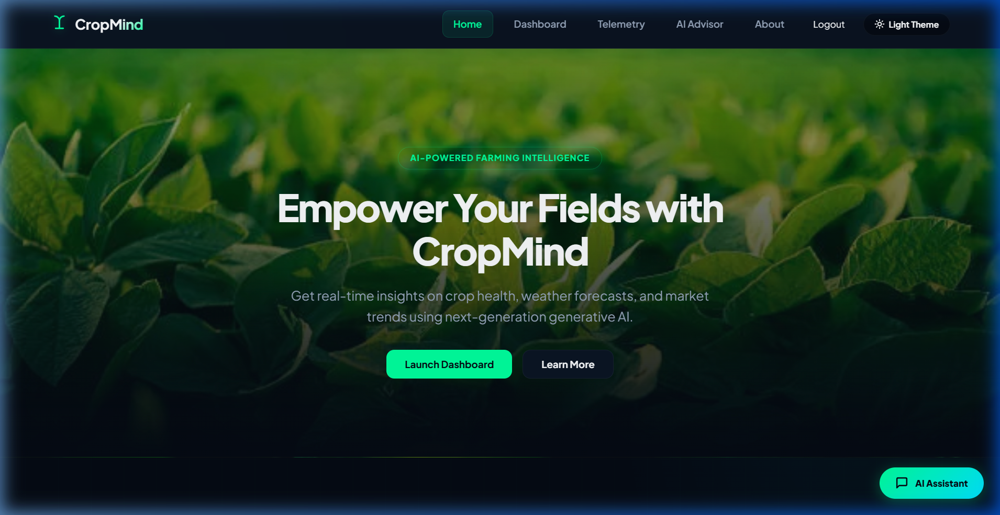
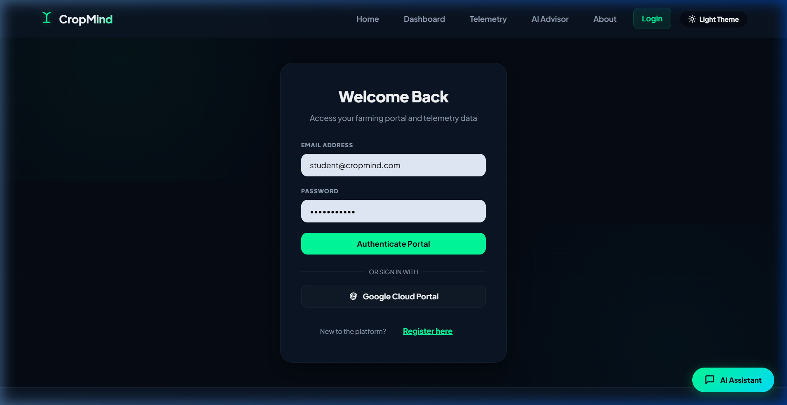
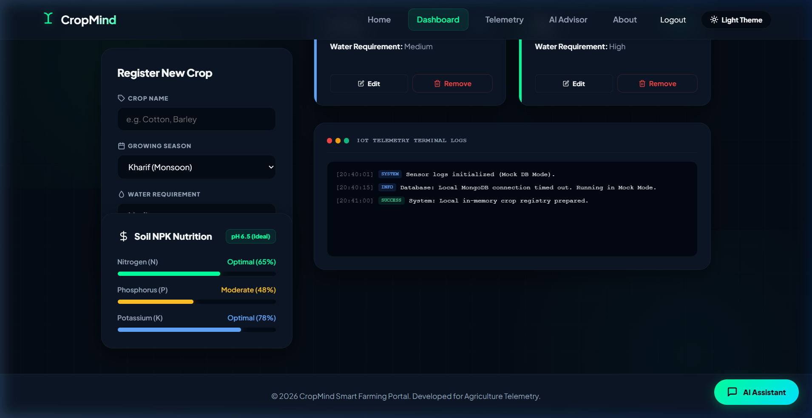
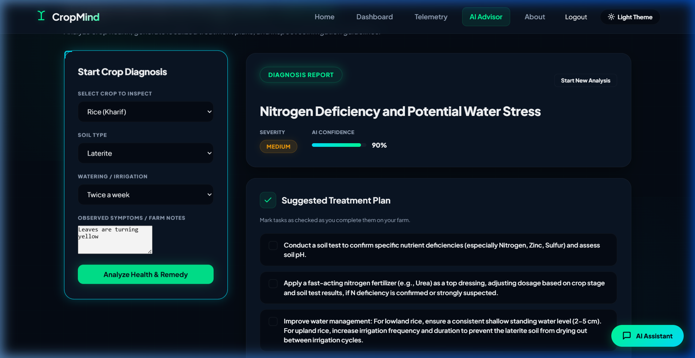

# CropMind - AI-Powered Smart Farming Assistant

CropMind is an advanced smart agricultural intelligence platform designed to empower modern farming decisions. By connecting real-time local IoT soil sensors and APMC mandi market telemetry with state-of-the-art Generative AI models, CropMind provides actionable insights directly to farmers for crop cataloging, weather-aware planning, disease diagnosis, and hydro-efficiency.

---

## Live Demo
* **Frontend Web Application (Vercel):** [https://crop-mind-chatbot-frontend.vercel.app](https://crop-mind-chatbot-frontend.vercel.app)
* **Backend Core API (Render):** [https://cropmind-chatbot-backend.onrender.com](https://cropmind-chatbot-backend.onrender.com)

---

## Screenshots

### 1. Home / Landing Screen
*A premium dark-themed cybernetic HUD dashboard greeting farmers with interactive guides.*


### 2. Secure Portal Authentication
*Registration and login page with integration for Google OAuth developer sandbox mode.*


### 3. Smart Farming Dashboard HUD
*Displays soil moisture, predictive rain probability, real-time APMC Mandi market price sparklines, a crop catalog registry, and live sensor logs.*


### 4. AI Agronomist Diagnostic Advisor
*Interactive crop symptom analysis generating organic treatment checklists, preventative measures, and customized NPK guidance.*


---

## Features
* **Crop Catalog Registry**: CRUD capabilities to add, update, and remove crops. Crop data is persisted directly in MongoDB (or a safe in-memory database fallback during local testing).
* **Farming Telemetry HUD**: Active tracking widgets indicating optimal soil moisture (72%), predictive rain probability (40%), and wholesale APMC Mandi price tickers.
* **Price Sparkline Visualization**: Embedded SVG sparklines illustrating wholesale wheat price trends (+1.2% daily shifts).
* **AI Agronomist Diagnostics**: Fully-featured diagnostic form that evaluates soil type, watering schedules, and crop symptoms to compile detailed agricultural advice.
* **Interactive Treatment Checklists**: Generates checkable organic and chemical intervention tasks that update client states dynamically.
* **Floating AI Chat Assistant**: Floating bubble widget present on all pages, enabling natural-language conversations with a custom agronomist model.
* **Dual Color Themes**: Built-in support for high-contrast light and dark themes using modern CSS variables.

---

## Tech Stack

### Frontend Client
* **Framework**: React 19
* **Build Tool**: Vite 7
* **Routing**: React Router DOM 6
* **Styling**: Vanilla CSS (TailwindCSS omitted for customizable grid layout and custom responsive theme animations)

### Backend Engine
* **Runtime**: Node.js
* **Framework**: Express 5
* **Authentication**: JSON Web Tokens (JWT) & Passport.js (Google OAuth 2.0 with Developer Sandbox consent screen)
* **Validation**: Zod Schemas

### Database Layer
* **Primary DB**: MongoDB Community Server / MongoDB Atlas Cloud
* **Object Modeler**: Mongoose (strict schema validation)
* **Mock Fallback**: Auto-switching In-Memory Database store (runs instantly out-of-the-box if MongoDB connection selection times out)

### AI Core
* **Model**: Google Gemini 2.5 Flash API (secured behind the backend proxy configuration)

### Deployment Platforms
* **Frontend**: Vercel
* **Backend**: Render Web Service
* **Database**: MongoDB Atlas Shared M0 Tier Cluster

---

## Setup Instructions

### Prerequisites
* **Node.js**: Version 18.0.0 or higher.
* **MongoDB**: A running local instance (`mongodb://127.0.0.1:27017/cropmind`) OR a MongoDB Atlas cloud connection string. *(Optional fallback: The app will run in in-memory Mock DB mode if no database is detected).*

### Steps to Run Locally

#### 1. Clone and Navigate to the Repository
```bash
git clone https://github.com/deepanshi-code/CropMind-Chatbot.git
cd CropMind
```

#### 2. Configure Environment Variables
Create a `.env` file in the **`backend`** directory using the provided template:
```bash
cp backend/.env.example backend/.env
```
Open `backend/.env` and define the following variables:
```ini
PORT=5000
MONGO_URI=mongodb://127.0.0.1:27017/cropmind  # (Or your cloud MongoDB Atlas URI)
GEMINI_API_KEY=your_actual_gemini_api_key      # (Optional: floating chat uses mock brain if empty)
JWT_SECRET=your_custom_secure_jwt_secret_key
GOOGLE_CLIENT_ID=                             # (Optional: Sandbox simulated OAuth runs if left blank)
GOOGLE_CLIENT_SECRET=                         # (Optional: Sandbox simulated OAuth runs if left blank)
```

Create a `.env` file in the **`frontend`** directory:
```bash
cp frontend/.env.example frontend/.env
```
Open `frontend/.env` and verify the API URL:
```ini
VITE_API_URL=http://localhost:5000
```

#### 3. Install Monorepo Dependencies
Install all packages in the workspace root:
```bash
npm install
```

#### 4. Run the Dev Servers
Start both the Frontend and Backend concurrently using the workspace script:
```bash
npm run dev
```
* **Frontend Site**: Accessible at `http://localhost:5173/`
* **Backend Server**: Accessible at `http://localhost:5000/`

---

## API Documentation

The backend server runs on `http://localhost:5000` by default and exposes these key REST API endpoints. You can view the live interactive developer portal at `http://localhost:5000/docs`.

### 1. Authentication
* **`POST /api/auth/register`**: Registers a new farmer user.
  * *Request Body*: `{"email": "farmer@cropmind.com", "password": "password123"}`
* **`POST /api/auth/login`**: Verifies password credentials and issues a session JWT.
  * *Response*: `{"token": "JWT_TOKEN", "user": {"email": "farmer@cropmind.com"}}`
* **`GET /api/auth/google`**: Triggers Google OAuth 2.0 flow. Redirects to Sandbox Simulator if Google client variables are not defined.

### 2. Crop Registry (Requires Bearer Token)
* **`GET /api/crops`**: Retrieves all crop entries.
* **`POST /api/crops`**: Registers a new crop.
  * *Request Body*: `{"name": "Barley", "season": "Rabi", "water": "Low"}`
* **`PUT /api/crops/:id`**: Modifies an existing crop's season or name.
* **`DELETE /api/crops/:id`**: Removes a crop record from the catalog.

### 3. Telemetry Logs (Requires Bearer Token)
* **`GET /api/telemetry`**: Retrieves the 30 most recent active node logs.
* **`POST /api/telemetry`**: Registers a new log from an IoT telemetry sensor.
  * *Request Body*: `{"time": "12:00:00", "type": "warning", "text": "Low moisture."}`

### 4. AI Agronomist Proxies
* **`POST /api/chat`**: Securely proxies prompts to Google's Gemini API, hiding the secret API key from the client-side network panel.
  * *Request Body*: `{"message": "How do I grow organic carrots?"}`

---

## Architecture & Folder Structure

CropMind follows a modular monorepo architecture separating the visual client (Frontend) and the server controllers (Backend).

```
CropMind/
├── backend/                  # Node.js Server & Database Configuration
│   ├── middleware/           # JWT verification routes
│   ├── models/               # MongoDB Mongoose Schemas (User, Crop, TelemetryLog)
│   ├── routes/               # API route managers (auth, ai)
│   ├── db.js                 # Safe database connector & local mock store fallback
│   ├── server.js             # Main server controllers & docs endpoints
│   └── package.json
│
├── frontend/                 # Vite + React Client
│   ├── public/               # Favicon & assets
│   ├── src/
│   │   ├── assets/           # Dashboard hero visuals
│   │   ├── components/       # Modular UI elements (NPKGauge, PriceSparkline, Chat)
│   │   ├── pages/            # View pages (Home, Dashboard, Telemetry, Advisor, About, Login)
│   │   ├── services/         # Client Axios API interceptors
│   │   ├── App.jsx           # Routing & dark-theme triggers
│   │   └── styles.css        # Core custom layout responsive styles
│   └── package.json
│
├── screenshots/              # Embedded documentation images
└── package.json              # Monorepo Workspace configuration
```

---

## Known Limitations

* **Render Server Spin-Down (Cold Start)**: The backend is deployed on a free Render tier. As a result, the server spins down after **15 minutes of inactivity**. The first API call sent to the app after a period of dormancy will trigger a cold-start, requiring **30 to 60 seconds** to boot.
* **MongoDB M0 Storage Ceiling**: The database uses MongoDB Atlas's free M0 cluster, which has a memory capacity limit of **512 MB**, suitable only for developer testing and demonstration.
* **Google Sandbox OAuth Account Limit**: When Google Client ID variables are omitted from the backend env configuration, the login redirects to a sandbox OAuth simulation. This sandbox is hardcoded to authorize `mock-farmer@cropmind.com`.

---

## Credits & Acknowledgements
* **Mentorship & Evaluation**: Developed for the TBI-GEU Internship Capstone.
* **AI Engine**: Powered by Google DeepMind's Gemini API developer sandbox models.
* **Tech Guidelines**: Implemented in accordance with the Advanced Agentic Coding practices.
